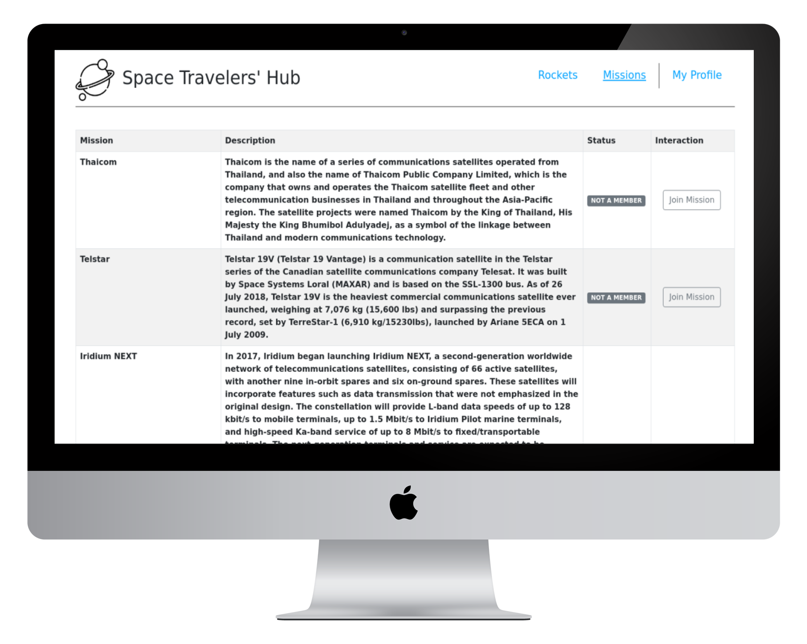
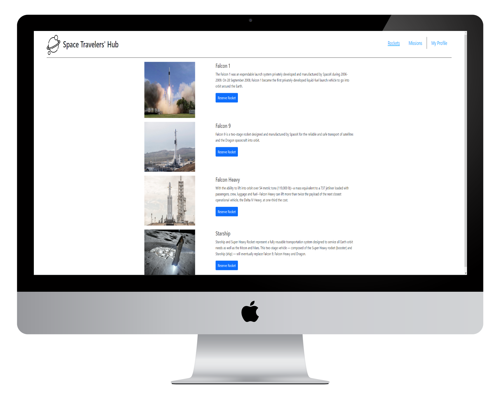

# The Space Travelers' Hub

> The Space Travelers' Hub is a React app which allows the user to manage the booking of SpaceX rockets and joining missions. The user can manage all his subscriptions in My Profile section where all the Rockets and Missions selected previously are displayed.

## App screenshot 
 



## Built With

- React
- Redux
- Jest
- JavaScript
## Live Demo 

[Live Demo Link](https://wandergithub.github.io/travelers-hub/)

## Usage  

Be sure to have [Node.js](https://nodejs.org/) installed before proceeding.

```shell
# Clone the repo
git clone https://github.com/aliveGUY/travelers-hub
# Change directory
cd travelers-hub
# Install dependencies
npm i
# Start local server
npm run start
```


## Authors

👤 **Wander Gonzalez**


- GitHub: [@wandergithub](https://github.com/wandergithub)
- Twitter: [@wanderklk1](https://twitter.com/wanderklk1)
- LinkedIn: [Wander A. Gonzalez](https://www.linkedin.com/in/wander-gonzalez/)

👤 **Illia Dubrovin**

- GitHub: [@githubhandle](https://github.com/aliveGUY)
- Twitter: [@twitterhandle](https://twitter.com/Sciborskyy)
- LinkedIn: [LinkedIn](https://www.linkedin.com/in/ilya-dubrovin-921a2721b/)

## 🤝 Contributing

Contributions, issues, and feature requests are welcome!

Feel free to check the [issues page](../../issues/).

## Show your support

Give a ⭐️ if you like this project!


## 📝 License

This project is [MIT](./MIT.md) licensed.
